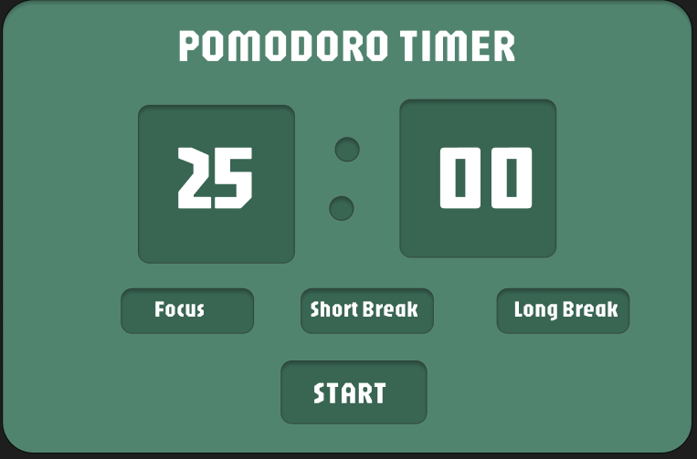

# Pomodoro Timer

A clean and simple browser-based Pomodoro Timer web app to help you manage focus and break times. This project was built using HTML, CSS, and JavaScript.

## About This Project

This project is my plan to build a functional Pomodoro timer from scratch. This image is the prototype design I created that I will be building with code.

## Features to Build

* Focus Timer: A 25-minute work session.
* Short Break: A 5-minute short break timer.
* Long Break: A 15-minute long break timer.
* A clean UI based on my prototype design.
* Clickable buttons that switch between the three modes.
* A pause button that can stop timer when i focus mode

## My Plan

This is the plan I will follow.

1.  **HTML Structure:** Create the `index.html` file with the main layout (title, timer display, and three buttons).
2.  **CSS Styling:** Create the `style.css` file to make the app look like my prototype design (colors, fonts, layout).
3.  **JavaScript Timer Logic:** Create the `app.js` file and write the main countdown function.
4.  **Button Functionality:** Connect the "Focus", "Short Break", and "Long Break" buttons to the timer logic.
